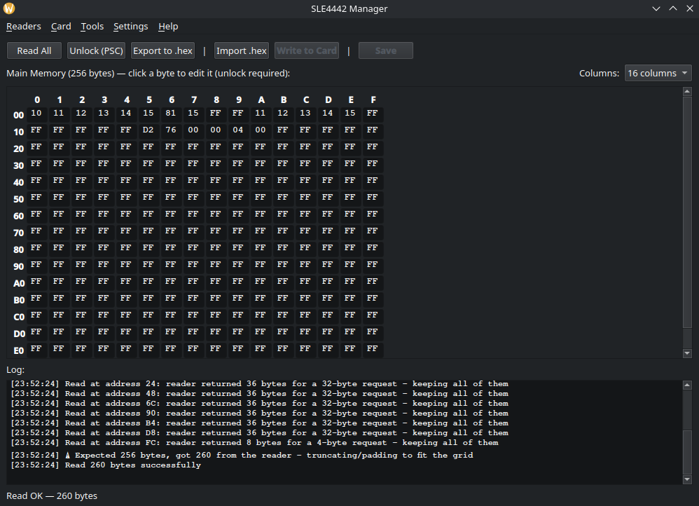
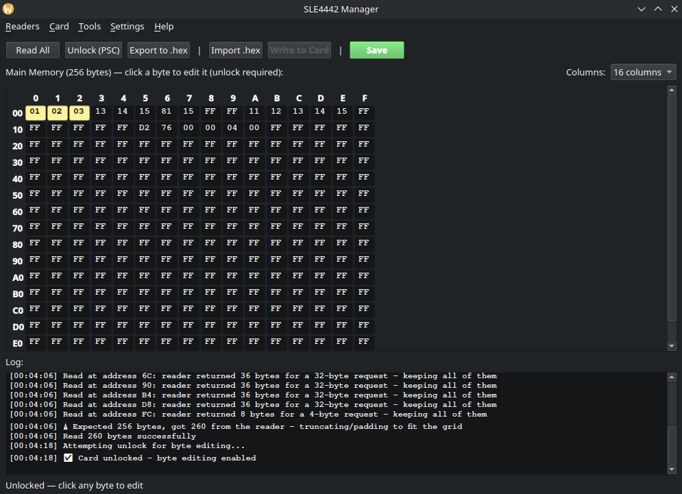
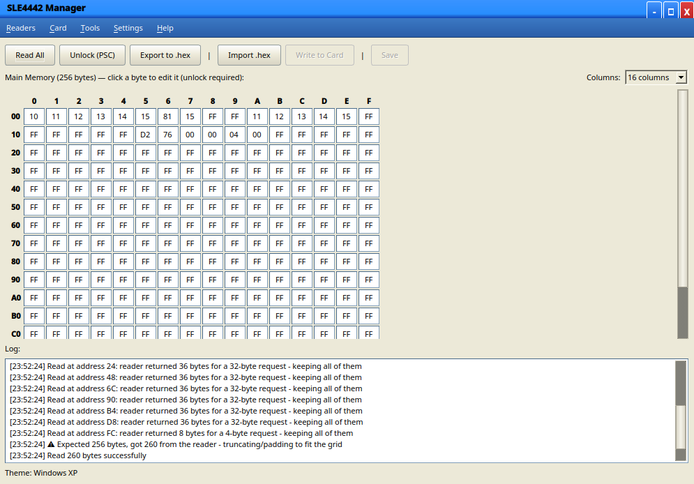

# SLE4442 Manager

A comprehensive tool for reading, writing, and managing SLE4442 smart cards with both GUI (PyQt5) and CLI support.

<p align="center"></p>


## Acknowledgments

Thanks to [@luu176](https://github.com/luu176/SLE4442-Card-Manager) and [@hvfrancesco](https://github.com/hvfrancesco/SLE4442-card-manager) for their previous work.

## Features
- **Read and Write card memory**
- **Import/Export** raw HEX format files
- **Read security memory** (error counter and protection bits)
- **Unlock and Change PSC** (PIN)
- **Send raw APDU commands** for advanced operations
- **Multiple reader support** with automatic detection
- **APDU logging** for debugging
- **Full CLI support** for automation and scripting

**GUI Overhaul (added by [@edomari](https://github.com/edomari)):**
- **Interactive byte-by-byte grid editing** with unsaved changes tracking (highlights modified bytes)
- **Dynamic grid formatting** (switch between 8, 16, and 32 columns instantly)
- **Theme support** featuring a retro Windows XP mode

## Screenshots

### Interactive Memory Grid
<p align="center"></p>

### Read Operations
<p align="center"></p>

### Export and Import
<p align="center"></p>
<p align="center"></p>

### Write Operations
<p align="center"></p>

### Write one or more bytes
<p align="center"></p>

### PIN Management and Exception Handling
<p align="center"></p>

### Raw APDU and Logs
<p align="center"></p>

### Windows XP Theme
<p align="center"></p>

## Quick Start

```bash
pip install pyscard
pip install PyQt5 # Optional, for GUI mode

python sle4442_manager.py
python sle4442_manager.py --nogui # for CLI mode